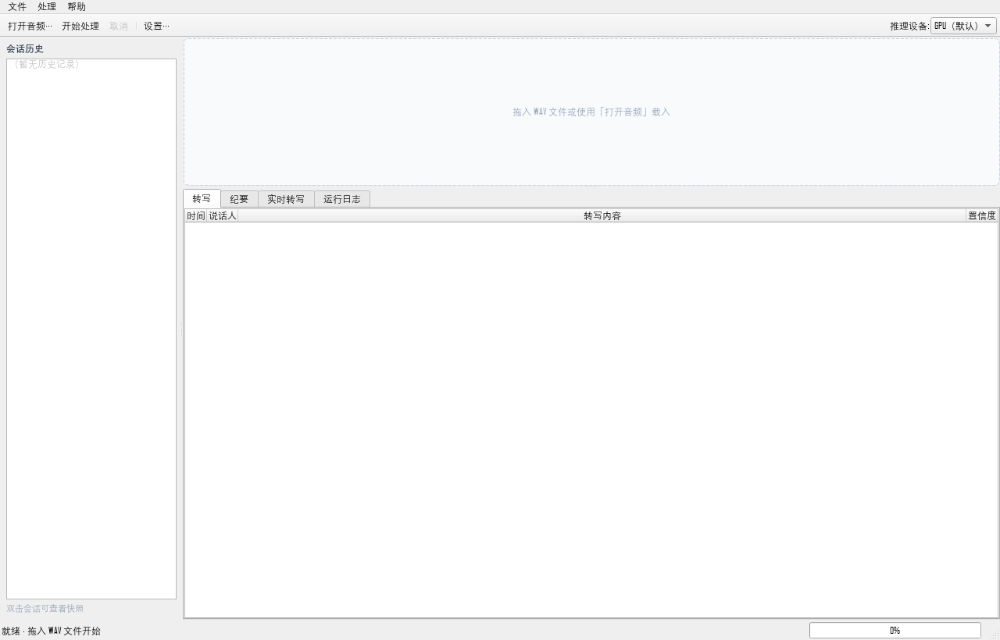
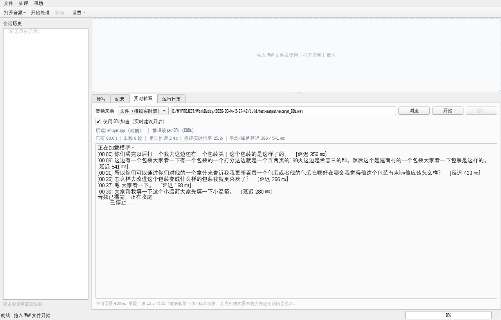

# MeetMind · 端侧语音转写与智能会议纪要工具

> 一份会议录音进，一份结构化会议纪要出 —— **全流程在本机完成，不产生任何网络请求**。

[]()
[]()
[]()
[]()
[]()
[-76b900)]()

| 主界面（工具栏右侧可切换 GPU / CPU） | 实时转写（GPU 推理，逐句出稿） |
| --- | --- |
|  |  |

---

## 1. 它解决什么问题

会议纪要靠人工整理，存在三个痛点：**耗时长**（1 小时会议常需 0.5–1 小时整理）、**隐私风险**（云端方案需上传原始音频）、**网络依赖**（内网隔离或涉密环境不可用）。

MeetMind 的做法是：把整条链路（音频解码 → 语音检测 → 语音识别 → 说话人分离 → 中文 NLP → 纪要生成 → 多格式导出）全部放在本机跑完，音频与文本数据不离开本机。

音频转写**默认启用 GPU**：GPU 版构建下无需任何参数即走 NVIDIA CUDA（实测 small 模型约 40× 实时，比 CPU 快约 16 倍）；未编入 CUDA 后端的构建自动回退 CPU。同时支持**实时（流式）转写**——边进音频边出稿，出稿延迟约 0.3 秒。

---

## 2. 功能一览

| 模块 | 能力 |
| --- | --- |
| **音频接入** | WAV（PCM 8/16/24/32 bit、IEEE float 32/64 bit、`WAVE_FORMAT_EXTENSIBLE`）；多声道自动下混；任意采样率 → 16 kHz（带抗混叠 FIR） |
| **语音检测** | 自适应能量 + 过零率双门限、迟滞判决、噪声底跟踪、段合并/切分，输出毫秒级时间戳 |
| **语音识别** | 可插拔后端：`whisper.cpp`（GGML 端侧推理，**CPU 或 NVIDIA CUDA**）· 回放引擎（无模型回归测试）· 空引擎。含**转写单元分组**优化：把相邻语音段聚合为接近 30 秒窗口的单元，实测吞吐提升约 3.4 倍 |
| **GPU 加速** | 可选 CUDA 后端：MSVC+CUDA 单独编译 `whisper.dll`，MinGW 主程序以 C ABI 动态接入。实测 ASR 提速 **16.5×**（48× 实时），结果与 CPU 逐段一致 |
| **实时转写** | 在线 VAD 增量断句 + 后台推理线程，边进音频边出稿；出稿延迟约 **0.4 秒**。音频源可插拔（文件模拟实时流 / 麦克风） |
| **文本规范化** | 繁→简统一（whisper 常输出繁体）→ 逆文本正则化（`百分之三十` → `30%`、`三千万` → `30000000`、`二零二六年` → `2026年`、`九月` → `9月`）→ 标点恢复 |
| **说话人分离** | 段级 MFCC 声纹嵌入（39 维）+ 凝聚式层次聚类 + 时间轴平滑；支持自动估计或指定人数 |
| **中文 NLP** | 自研最大概率路径分词（13.6 万通用词条 + 会议领域补充词典）、TextRank、TF-IDF、MMR 摘要、话题分段（TextTiling） |
| **智能纪要** | 会议概览 · 议题脉络 · 关键结论 · **会议决议** · **待办（任务/责任人/截止时间/优先级）** · 关键词 · 风险提示 |
| **导出** | Markdown · JSON（含 schemaVersion）· SRT 字幕 · 纯文本 · 自包含 HTML |
| **交互** | Qt6 界面（波形 + 语音段 + 说话人色带、转写表格、纪要面板、后台线程 + 可取消）· 命令行（批处理、dry-run、JSON 报告）· 会话历史 |

---

## 3. 快速开始

### 3.1 环境要求

| 组件 | 版本 | 说明 |
| --- | --- | --- |
| CMake | ≥ 3.20 | 构建系统 |
| Ninja | 任意 | 或使用 `mingw32-make` |
| MinGW-w64 GCC | ≥ 11（实测 13.1.0） | 支持 C++17 |
| Qt6 | ≥ 6.2（实测 6.7.1，Widgets） | 仅图形界面需要；缺失时自动跳过 GUI |
| Python | ≥ 3.8 | 仅用于生成词典与测试音频（可选） |
| **Visual Studio（含 C++ 工具链）+ CUDA Toolkit** | 实测 VS2019 / CUDA 12.3 | **仅 GPU 加速需要**（`nvcc` 只接受 MSVC 作宿主编译器）；无显卡时完全不需要 |

### 3.2 构建

```bash
# 构建（Release，含 CLI / GUI / 测试）
bash tools/build.sh release

# 只构建核心库（最快，用于语法检查）
bash tools/build.sh core

# GPU 加速构建（接入 CUDA 版 whisper.dll）
bash tools/build-whisper-cuda.sh   # 首次：用 MSVC+CUDA 生成 whisper.dll（约 7 分钟）
bash tools/build.sh gpu            # 构建主程序

# 其他模式
bash tools/build.sh dev    # 核心 + CLI + 测试（无 whisper、无 GUI）
bash tools/build.sh gui    # 含 GUI（无 whisper）
bash tools/build.sh all    # 使用缓存的开关配置
bash tools/build.sh clean  # 清理 build/
```

若 Qt6 不在默认路径：

```bash
bash tools/build.sh release   # 编辑脚本顶部的 QT_ROOT / MINGW_BIN / NINJA_DIR
# 或直接调用 CMake：
cmake -S . -B build -G Ninja -DCMAKE_BUILD_TYPE=Release \
      -DMEETMIND_QT_ROOT="C:/Qt/6.7.1/mingw_64"
```

**部署（可选，已默认执行）**

```bash
# 让 build/bin 自包含 Qt 与 MinGW 运行库，可直接拷给别人运行
"C:/Qt/6.7.1/mingw_64/bin/windeployqt.exe" --release --compiler-runtime \
    --no-translations --no-system-d3d-compiler --no-opengl-sw build/bin/MeetMind.exe
```

**构建开关**

| 选项 | 默认 | 说明 |
| --- | --- | --- |
| `MEETMIND_BUILD_CLI` | ON | 命令行工具 |
| `MEETMIND_BUILD_GUI` | ON | Qt6 图形界面（找不到 Qt6 自动关闭） |
| `MEETMIND_BUILD_TESTS` | ON | 测试可执行文件 |
| `MEETMIND_WITH_WHISPER` | ON | whisper.cpp 端侧推理（未找到 `third_party/whisper.cpp` 时自动关闭） |
| `MEETMIND_WHISPER_CUDA_DLL` | OFF | 接入预编译的 CUDA 版 `whisper.dll`（GPU 加速；需先跑 `tools/build-whisper-cuda.sh`）。开启后**运行时默认即用 GPU**，用 `--no-gpu` 或 `"useGpu": false` 可强制 CPU |
| `MEETMIND_GGML_OPENMP` | OFF | ggml 的 OpenMP 并行（实测本负载下更慢） |
| `MEETMIND_WARNINGS_AS_ERRORS` | OFF | 将告警视为错误 |

### 3.3 准备数据与模型

```bash
# 0) 获取 whisper.cpp 源码（仓库不内置，脚本按需下载；可用 WHISPER_MIRROR 指定镜像）
bash tools/fetch-whisper.sh

# 1) 生成中文词典（需要 jieba 的 dict.txt；也可直接使用仓库内已生成的 data/lexicon_zh.txt）
python tools/prepare_data.py           # 生成中文词典
python tools/prepare_data.py --t2s     # 生成繁→简映射表（需 pip install zhconv）

# 2) 下载 whisper ggml 模型（约 142 MB / 466 MB）
#    放到 models/ 目录即可被自动探测（优先 small > base > tiny）
curl -L -o models/ggml-base.bin  https://huggingface.co/ggerganov/whisper.cpp/resolve/main/ggml-base.bin
curl -L -o models/ggml-small.bin https://huggingface.co/ggerganov/whisper.cpp/resolve/main/ggml-small.bin

# 3) 生成一段中文会议测试音频（Windows SAPI，需 pywin32）
python tools/gen_meeting_audio.py
```

### 3.4 运行

```bash
# 命令行：完整处理 + 全部格式导出
./build/bin/meetmind-cli meeting.wav -o out --formats md,json,srt -m models/ggml-small.bin -l zh

# 查看后端状态与选择理由
./build/bin/meetmind-cli --list-engines

# 批处理目录下所有 WAV
./build/bin/meetmind-cli --batch ./recordings -o ./minutes

# 只看流程、不加载模型（回放引擎）
./build/bin/meetmind-cli meeting.wav --backend replay --script data/fixtures/meeting_zh.script.txt

# 调优转写单元（默认 29000ms / 2500ms；设为 0 则逐段转写）
./build/bin/meetmind-cli meeting.wav --unit-ms 29000 --unit-gap 2500

# GPU 加速：GPU 版构建下**默认即启用**，无需额外参数
#   （先用 tools/build-whisper-cuda.sh + tools/build.sh gpu 构建）
./build/bin/meetmind-cli meeting.wav -m models/ggml-small.bin -l zh
./build/bin/meetmind-cli meeting.wav --no-gpu -m models/ggml-small.bin -l zh   # 强制走 CPU

# 实时（流式）转写：边进音频边出稿，逐句打印
./build/bin/meetmind-cli meeting.wav --realtime --gpu -m models/ggml-small.bin -l zh
./build/bin/meetmind-cli meeting.wav --realtime --speed 10 --gpu -m models/ggml-small.bin -l zh  # 十倍速压测

# 语言：-l auto 为默认值（自动识别语言并继续转写）；指定 zh / en 可跳过检测

# 图形界面
./build/bin/MeetMind.exe
./build/bin/MeetMind.exe -i meeting.wav      # 启动即处理
./build/bin/MeetMind.exe -c config.json -i meeting.wav   # 指定配置文件
```

### 3.5 直接启动（Windows）

构建完成后 `build/bin/` 已通过 `windeployqt` 自包含 Qt 与 MinGW 运行库（约 52 MB），可直接分发。

| 脚本 | 用途 |
| --- | --- |
| `run-gui.bat` | 双击启动图形界面（自动加载 `config/meetmind.json`） |
| `run-gui.bat <音频.wav>` | 启动界面并直接处理指定音频 |
| `run-cli.bat` | 双击查看命令行帮助（不带参数时打印 `--help`） |
| `run-cli.bat <音频.wav> -o output` | 命令行处理 |

> 启动脚本刻意保持**纯 ASCII**：`cmd.exe` 按当前代码页解析 `.bat`，脚本内含中文在非 UTF-8
> 代码页下会被错误解码。中文提示统一放在本文档中。

默认配置文件 `config/meetmind.json` 已开启 whisper 端侧推理、繁转简、说话人分离与四种导出格式，
可直接按需修改（`modelPath` 为相对路径，启动脚本会先切到项目根目录）。

### 3.6 运行测试

```bash
./build/bin/mm_tests.exe -v              # 全部用例，打印耗时
./build/bin/mm_tests.exe -f nlp          # 只跑名称含 "nlp" 的用例
./build/bin/mm_tests.exe --list          # 列出全部用例
./build/bin/mm_tests.exe -q              # 关闭引擎日志
```

---

## 4. 项目结构

```
MeetMind/
├── CMakeLists.txt              构建定义（mm_core / mm_cli / mm_gui / mm_tests）
├── docs/                       工程文档
│   ├── 01-需求规格说明书.md
│   ├── 02-系统设计说明书.md
│   ├── 03-接口文档.md
│   ├── 04-测试计划与报告.md
│   └── 05-开发流程说明.md
├── data/
│   ├── lexicon_zh.txt          通用中文词典（13.6 万词条，含词频与词性）
│   ├── lexicon_extra.txt       会议/研发领域补充词典（通用词典缺「排期」等术语）
│   ├── t2s_zh.txt              繁→简字符映射表（4303 条）
│   ├── stopwords_zh.txt        停用词表
│   └── fixtures/               测试音频与参考脚本
├── src/mm/
│   ├── common/                 基础层：Result / Logger / Json / 字符串 / 时间 / 配置
│   ├── audio/                  音频层：WAV / 重采样 / FFT / Mel-MFCC / VAD / 分段
│   ├── asr/                    识别层：IAsrEngine / whisper.cpp / 回放 / 工厂
│   ├── diar/                   说话人层：声纹嵌入 / 层次聚类 / 分离器
│   ├── nlp/                    NLP 层：分词 / ITN / 标点 / TextRank / 摘要 / 待办 / 纪要
│   ├── pipeline/               编排层：Pipeline / Exporter
│   ├── storage/                持久化：会话历史
│   ├── cli/                    命令行入口
│   └── gui/                    Qt6 界面
├── tests/                      测试工程（轻量框架 + 136 个用例）
├── tools/                      构建 / 数据准备 / 测试音频脚本
└── third_party/whisper.cpp     可选端侧推理引擎（未包含时自动降级）
```

---

## 5. 处理流水线

```
[1] 解码 WAV           → 单声道 float32 + 音频质量报告        (0–8%)
[2] 重采样至 16 kHz    → 抗混叠 FIR + 线性插值                (8–12%)
[3] VAD 与分段         → 自适应双门限 + 迟滞 + 段合并/切分      (12–18%)
[4] 逐段识别           → IAsrEngine（whisper.cpp / 回放）      (18–70%)
[5] 说话人分离         → MFCC 嵌入 + 层次聚类 + 标签平滑        (70–78%)
[6] 文本规范化         → ITN + 标点恢复                       (78–84%)
[7] 纪要生成           → 分词 → TextRank → MMR → 待办/决议抽取  (84–96%)
[8] 导出               → MD / JSON / SRT / TXT / HTML         (96–100%)
```

**健壮性设计**：任一转写段失败不会丢弃其余结果（保留空文本占位以维持索引对齐）；每个阶段边界与每个转写段之间检查取消令牌；导出使用「临时文件 + 原子替换」。

---

## 6. 端侧与隐私

- 核心库与 GUI 均**不含任何网络调用**（`src/` 全量检索无 `socket/http/curl/WinHTTP` 调用）；
- 设置环境变量 `MEETMIND_OFFLINE=1` 可强制离线（供可选的网络型扩展遵循）；
- 日志默认只记录长度、时长、文件名，**不记录音频正文**；
- 导出文件名经过路径穿越净化（`..`、`/\:*?"<>|`、Windows 保留名）。

---

## 7. 已知限制

| 限制 | 说明 |
| --- | --- |
| 输入格式 | 仅支持 WAV；MP3/M4A 等需先转码 |
| 识别准确率 | 实测 whisper **small** 对 SAPI 合成中文会议的转写相似度 94.7%；专有名词（如人名「李四」）可能被误识为近音词 |
| 说话人分离 | 基于 MFCC 统计量的弱声纹嵌入；单一声源或音色高度相似时会判为单说话人（结果中 `degraded = true` 并给出原因）。实测对单一合成音色的音频可能产生虚假切换 |
| 说话人分离 | 短于 300 ms 的段不参与建模，标签由前一段继承 |
| ITN | 口语省略式（「两千五」读作 2500）按字面解析为 2005，不做口语补全 |
| 摘要算法可替换 | `ISummarizer` 接口可插拔，默认离线抽取式（MMR + TextRank），可用自定义实现替换 |
| 实时转写 | 已实现（在线 VAD + 后台推理，出稿延迟约 0.4 s）。**麦克风来源需 Qt 界面且要有真实录音设备**；命令行内置的是「文件模拟实时流」，用于验证链路 |  
| 实时转写的时延 | 时延下限 = 判句停顿（默认 600 ms）+ 采集块长。说话人长时间不停顿时会持续积压，靠 `--rt-segment` 强制切段兜底 |
| 分发形态 | 已用 `windeployqt` 部署运行库（`build/bin` 自包含），但**未做安装器/绿色包**，也未在无 Qt 环境的干净机器上验证。GPU 版额外需要约 290 MB 的 CUDA 运行时 DLL |
| 转写速度 | **GPU（CUDA）：small 模型 39–48× 实时**；CPU：small 约 2.1×、base 约 4–5× 实时。显存占用约 490 MB（small） |

---

## 8. 相关文档

| 文档 | 内容 |
| --- | --- |
| [需求规格说明书](docs/01-需求规格说明书.md) | 功能/非功能需求、验收标准、需求追踪矩阵 |
| [系统设计说明书](docs/02-系统设计说明书.md) | 架构、模块设计、算法选型与理由、性能/安全设计 |
| [接口文档](docs/03-接口文档.md) | 全部公开 API、实现契约、扩展方式 |
| [测试计划与报告](docs/04-测试计划与报告.md) | 测试策略、用例清单、覆盖率、性能实测、端到端验证 |
| [开发流程说明](docs/05-开发流程说明.md) | 迭代过程、缺陷修复记录、工程决策记录 |
| [性能优化 · GPU 加速 · 实时转写](docs/06-性能优化与GPU说明.md) | CPU 调优实测、CUDA 方案与踩坑、实时转写架构与实测 |
| [真实数据测试问题记录](docs/07-真实数据测试问题记录.md) | 真实录音暴露的问题清单与修复过程 |

---

<sub>MeetMind v1.0.0 · C++17 · Qt 6 · CMake · 零第三方运行时依赖</sub>
